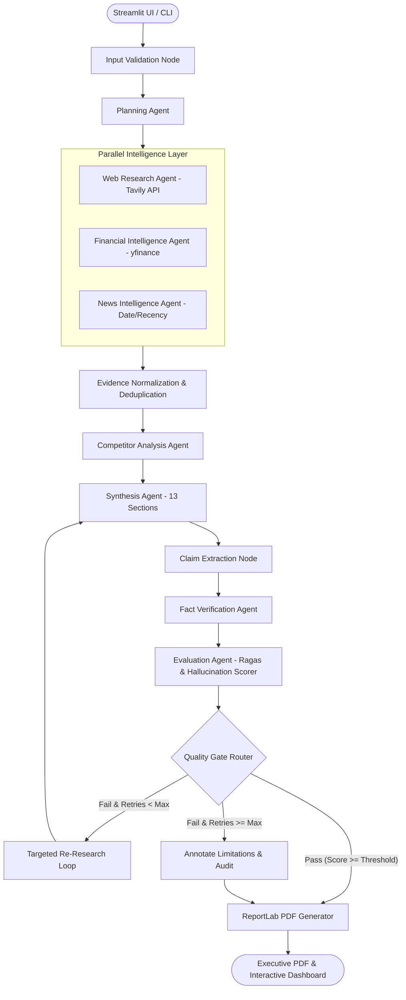

# Enterprise_Competitor_Intelligence

## Enterprise Multi-Agent Competitor Intelligence System

An autonomous, multi-agent AI research platform that accepts natural-language competitor and market queries, decomposes them into explicit research plans, gathers multi-source evidence across Web, Financial, and News providers in parallel, synthesizes a grounded 13-section executive report, verifies atomic claims against evidence, benchmarks hallucination risk, executes a self-correction loop, generates a boardroom-ready ReportLab PDF, and provides a multi-tab Streamlit dashboard.

---

## 🏛️ System Architecture



---

## 👥 Specialized Agent Roster

| Agent | Module | Responsibility |
|---|---|---|
| **Planning Agent** | `agents/planner_agent.py` | Interprets natural-language user queries and decomposes them into structured, prioritized tasks across research branches. |
| **Web Research Agent** | `agents/web_research_agent.py` | Gathers technical architecture, product moats, developer adoption, and strategy evidence via Tavily. |
| **Financial Intelligence Agent** | `agents/financial_agent.py` | Fetches audited financial fundamentals, revenue growth, margin structures, and valuation multiples via `yfinance`. |
| **News Intelligence Agent** | `agents/news_agent.py` | Identifies recent announcements, M&A, partnerships, and regulatory developments with date-stamped recency. |
| **Evidence Normalizer** | `tools/source_utils.py` | Cleans, deduplicates, ranks, and weights sources by reliability tiers (Tier 1: SEC/IR, Tier 2: Established Tech Press, Tier 3: General Web). |
| **Competitor Analysis Agent** | `agents/competitor_agent.py` | Synthesizes per-company SWOT profiles and cross-company strategic positioning matrices. |
| **Synthesis Agent** | `agents/synthesis_agent.py` | Authors boardroom-ready reports strictly grounded in retrieved evidence across 13 required sections. |
| **Claim Extractor** | `agents/claim_extractor.py` | Decomposes synthesized draft into discrete, testable atomic factual propositions. |
| **Fact Verification Agent** | `agents/fact_checker_agent.py` | Cross-references each atomic claim against the evidence pool and labels status: `Supported`, `Partially Supported`, `Unsupported`, `Contradicted`, `Insufficient Evidence`. |
| **Evaluation Agent** | `agents/evaluation_agent.py` | Calculates transparent Hallucination Scores, Support Rates, and Ragas/DeepEval quality metrics. |
| **Executive PDF Service** | `reports/pdf_generator.py` | Compiles multi-page PDF with corporate layouts, running headers/footers (`Page X of Y`), tables, and audit badges. |

---

## 📑 13 Mandatory Report Sections

1. **Executive Summary** — High-level strategic verdict and key takeaways.
2. **Research Scope and Methodology** — Defined boundaries, parameters, and evidence gathering processes.
3. **Market Overview** — Industry dynamics, macro tailwinds, and supply constraints.
4. **Company Profiles** — Deep-dive architecture and business model for each competitor.
5. **Financial Comparison** — Market cap, revenue growth, gross margins, operating margins, and P/E multiples.
6. **Recent Developments** — Date-aware product releases, M&A, partnerships, and announcements.
7. **Competitive Landscape** — Head-to-head positioning and architectural battlegrounds.
8. **Strengths and Differentiators** — Proprietary software moats, ecosystem scale, and hardware design.
9. **Risks and Opportunities** — Supply chain bottlenecks, regulatory scrutiny, and custom ASIC threats.
10. **Strategic Insights** — Systems-level implications and forward-looking strategic recommendations.
11. **AI Research Quality Metrics** — Summary of evidence grounding, verification status, and quality score.
12. **Limitations** — Explicit disclosures on data freshness, source constraints, and unverified areas.
13. **References** — Authoritative bibliography of all primary filings, articles, and URLs.

---

## 🧮 Fact Verification & Hallucination Scoring

The system strictly measures and enforces factual grounding using custom and Ragas-compatible metrics:

$$\text{Support Rate} = \frac{\text{Supported Claims} + 0.5 \times \text{Partially Supported Claims}}{\text{Total Checkable Claims}}$$

$$\text{Hallucination Score (\%)} = \frac{\text{Unsupported Claims} + \text{Contradicted Claims}}{\text{Total Checkable Claims}} \times 100$$

- **Quality Gate Rule**: If $\text{Hallucination Score} > 15\%$ or $\text{Support Rate} < 70\%$, the workflow triggers the **Targeted Re-Research Self-Correction Loop** to retrieve targeted evidence for failed claims and re-synthesize ungrounded statements.

---

## 🖥️ Streamlit Multi-Tab Dashboard

Launch the interactive UI:
```bash
streamlit run app.py
```

### 5 Dedicated Pages / Tabs:
1. **🎯 Research Setup**: Custom queries, company selection, focus areas, date range, API keys, and one-click preset scenarios (NVIDIA vs AMD vs Intel, Cloud AI Giants, EV & Mobility).
2. **🔄 Agent Execution**: Real-time progress bar, animated agent status cards, and live activity stream.
3. **📊 Intelligence Dashboard**: Executive summary callout, interactive financial comparison table, SWOT profiles, and strategic positioning matrix.
4. **🔍 Quality & Evidence**: Hallucination gauge, Ragas radar cards, claim-by-claim verification table with status filters, and deduplicated evidence explorer.
5. **📑 Executive Export**: Instant download for ReportLab Executive PDF (`.pdf`), Full Markdown (`.md`), and Raw State (`.json`).

---

## 🚀 Quickstart & Setup

### 1. Install Dependencies
```bash
pip install -r requirements.txt
```

### 2. Configure Environment Variables (Optional)
Copy `.env.example` to `.env`:
```bash
cp .env.example .env
```
Add your API keys (e.g. `GOOGLE_API_KEY`, `OPENAI_API_KEY`, `TAVILY_API_KEY`). *Note: The system contains built-in offline benchmark fallbacks, so it can run complete end-to-end demonstrations even without active API keys.*

### 3. Run Test Suite
```bash
python -m pytest tests/ -v
```

### 4. Run CLI Research Service
```bash
python -c "from services.research_service import run_competitor_research; res = run_competitor_research('Compare NVIDIA, AMD, and Intel'); print('PDF Generated at:', res.get('pdf_path'))"
```
